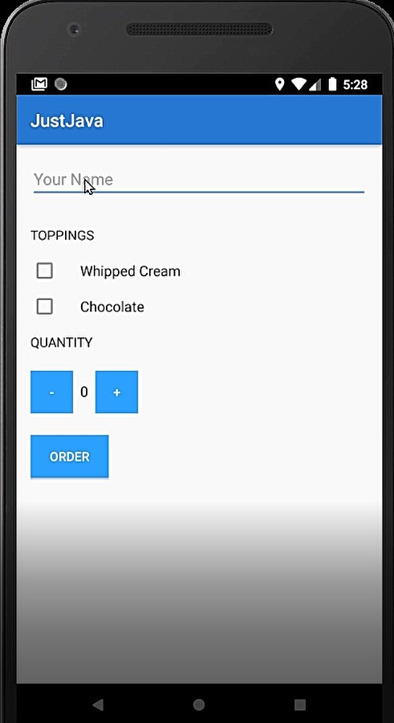
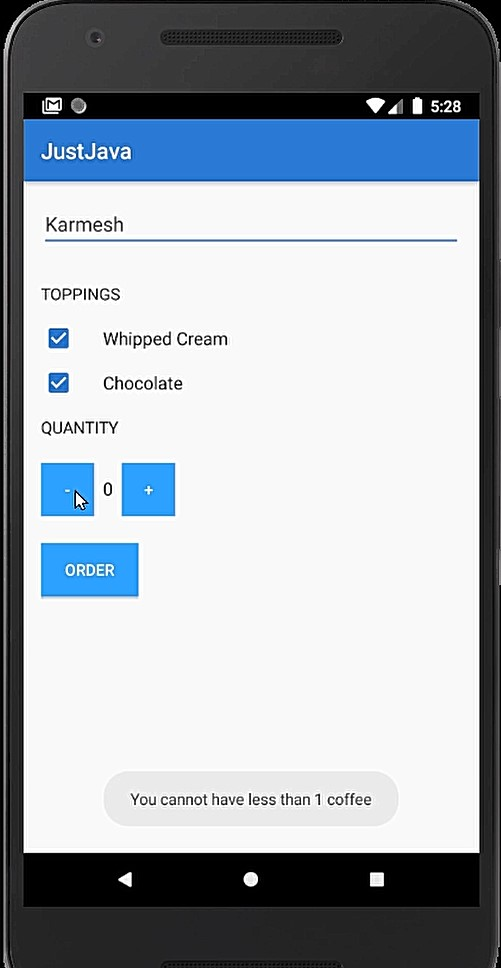
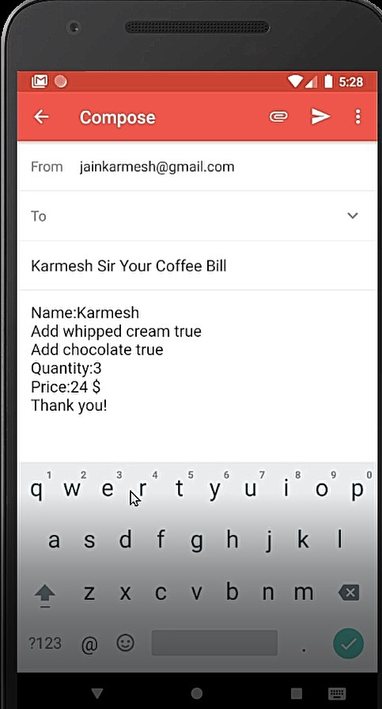

# Just Java App
===================================
JustJava is a basic coffee ordering android app to get familiarized with android basics such as views, layouts, intents, activities, etc

The idea of the App: Late nights are very common these days. The JustCofee app allows the user the order coffee with toppings of their choice.
Once the user is ready to order they add the order to cart.
The user is then navigated to the information page where they give their personal information.
On finalizing the order an email is sent to our email address with the order details

ScreenShots
---------------

Lessons Learned
----------
JustJava App learn about Variables,Debug mode,Nested view group,
Strings,Integers,Scope,Methods,onClick,Functions,Class,Objects,Inheritance,
Booleans,Conditions,Operators,Styles,Themes,Intents.
